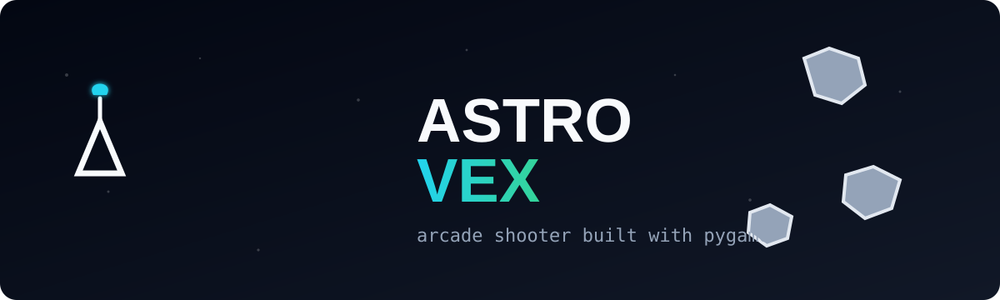

## astro-vex



`astro-vex` is an arcade space shooter built with Python + Pygame, with random-room online multiplayer and progression systems for replayability.

## What Players Compete For
- Solo mode: survive waves and chase high score.
- Online mode: join random rooms and compete on room + global online leaderboards.

## Features
- Animated home screen with parallax starfield and moving ships.
- Main menu options: `Start Solo`, `Start Online`, `Settings`, `Quit`.
- Scene/state-based flow: Home, Playing, Respawning, Paused, Game Over, Settings.
- In-game pause menu: `Resume`, `Restart`, `Home`, `Settings`, `Quit`.
- Game-over menu: `Restart`, `Home`, `Settings`, `Quit`.
- 3-second respawn countdown before return to action.
- Polished panel-style overlays + status notifications.
- Spaceship hull rendering (wings/canopy) with per-player colors online.
- Triangular gameplay hitbox retained for fair collisions.
- Multiple weapon types:
- `1` Single
- `2` Spread
- `3` Rapid
- Shield and speed power-ups.
- Bomb system with fuse and blast radius (`B` to drop).
- AI companion drone:
- auto-targets nearby asteroids
- has its own health
- supports upgrades (`U`)
- Achievements:
- `Untouchable`: survive 1 wave with no damage
- `Demolitionist`: destroy 50 asteroids in 10 seconds
- `Overkill`: hit 10+ objects with one bomb
- Screen shake:
- on explosions
- on bomb drop/detonation
- on boss death
- Dynamic music states:
- calm (early/low pressure)
- intense (high enemy count)
- boss mode (boss present)
- Lumpy asteroid visuals and occasional boss asteroid spawns.
- Score, lives, wave counter, shield/speed state, drone state HUD.
- Sound effects for combat, menu, hits, respawn, upgrades, and boss death.

## Controls
- `W` / `S`: Thrust forward / reverse thrust
- `A` / `D`: Rotate left / right
- `Space`: Fire weapon
- `1` / `2` / `3`: Switch weapon
- `B`: Drop bomb
- `U`: Upgrade companion drone
- `Esc`: Pause / back from menus
- `Arrow Keys`: Menu navigation
- `Enter` or `Space`: Confirm menu selection

## Run Locally
1. Create and activate a Python virtual environment.
2. Install dependencies.

```bash
python -m pip install -e .
```

3. Start multiplayer server (for online rooms/leaderboard):

```bash
python multiplayer_server.py
```

4. Run the game client:

```bash
python main.py
```

## Multiplayer Notes
- Server endpoint is configured in `constants.py`:
- `MULTIPLAYER_SERVER_HOST`
- `MULTIPLAYER_SERVER_PORT`
- Players are assigned to random rooms up to `MULTIPLAYER_ROOM_SIZE`.
- Room state is relayed in real time and rendered as remote ships.
- Global leaderboard is maintained on the server from player score updates.

## Project Structure
- `main.py`: scenes, menus, gameplay, achievements, parallax, shake, UI, leaderboard rendering.
- `multiplayer_server.py`: random room assignment + state relay + global leaderboard.
- `multiplayer_client.py`: client networking/state sync.
- `player.py`: ship movement, weapons, bombs, power states, collision and ship rendering.
- `drone.py`: AI companion drone logic, targeting, health, upgrades.
- `achievements.py`: achievement tracking and unlock notifications.
- `asteroids.py`: lumpy asteroid behavior, splitting, boss flag.
- `asteroidfield.py`: asteroid and boss spawning.
- `shot.py`: bullet entity.
- `bomb.py`: bomb entity and detonation.
- `powerup.py`: shield/speed pickups.
- `explosion.py`: explosion effect sprite.
- `sounds.py`: SFX + dynamic music mode manager.
- `circleshape.py`: shared sprite base with wrap/collision helpers.
- `logger.py`: JSONL event/state logging.

## Contributions
Contributions are welcome.

1. Fork the repository.
2. Create a feature branch.
3. Implement and test your change.
4. Update `README.md` for any user-facing behavior change.
5. Open a pull request with a clear summary.

## Notes
- Generated logs are ignored by git: `game_state.jsonl`, `game_events.jsonl`.
- Gameplay/network tuning lives in `constants.py`.
